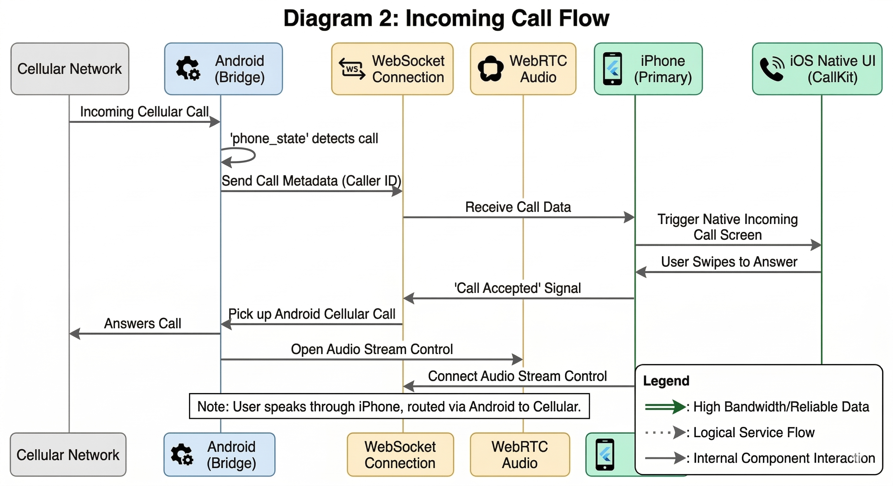

# Bridger App

Cross-platform phone bridge application that connects Android and iPhone devices, allowing the iPhone to use the Android's cellular capabilities (SMS, calls) while acting as the primary device.

## Project Status

**Phase 1: Project Setup & Foundation - ✅ COMPLETED**

### Completed Tasks:
- ✅ Flutter project structure created
- ✅ All dependencies configured in pubspec.yaml
- ✅ Android permissions and manifest configured
- ✅ iOS permissions and entitlements configured
- ✅ Dependency injection setup (GetIt)
- ✅ Theme system implemented (light/dark mode)
- ✅ Constants and utilities created
- ✅ Basic app shell with navigation (GoRouter)
- ✅ Splash screen and home screen implemented
- ✅ Bottom navigation with 5 tabs

### Project Structure:
```
bridge_phone/
├── lib/
│   ├── core/
│   │   ├── di/           # Dependency injection
│   │   ├── constants/    # App constants
│   │   ├── utils/        # Utility functions
│   │   └── theme/        # Theme configuration
│   ├── data/
│   │   ├── models/
│   │   ├── repositories/
│   │   └── datasources/
│   ├── domain/
│   │   ├── entities/
│   │   ├── repositories/
│   │   └── usecases/
│   ├── presentation/
│   │   ├── screens/
│   │   ├── widgets/
│   │   └── providers/
│   ├── services/
│   ├── main.dart
│   └── app.dart
├── android/              # Android native code
├── ios/                  # iOS native code
└── assets/              # Images, icons, certificates
```

## Getting Started

### Prerequisites
- Flutter SDK 3.5.0 or higher
- Dart SDK 3.5.0 or higher
- Android Studio / Xcode
- Android SDK (API 24+)
- iOS 13.0+ (for iOS development)

### Installation

1. **Clone the repository**
   ```bash
   cd bridge_phone
   ```

2. **Install dependencies**
   ```bash
   flutter pub get
   ```

3. **Run the app**
   ```bash
   # For Android
   flutter run -d android
   
   # For iOS (requires macOS)
   flutter run -d ios
   ```

### Building

```bash
# Android APK
flutter build apk --release

# Android App Bundle
flutter build appbundle --release

# iOS (requires macOS)
flutter build ios --release
```

## Current Features (Phase 1)

- ✅ Material Design 3 UI
- ✅ Light and Dark theme support
- ✅ Responsive navigation
- ✅ Platform-specific UI elements
- ✅ Dependency injection framework
- ✅ Secure storage setup
- ✅ Database foundation (SQLite/Drift)

## Upcoming Phases

### Phase 2: Database & Local Storage (Next)
- SQLite database schema
- CRUD operations
- Encryption service
- Local repositories

### Phase 3: Android BLE Peripheral
- BLE GATT server
- Service and characteristic setup
- Flutter platform channels

### Phase 4: iOS BLE Central
- BLE scanning and connection
- Background BLE support
- Reconnection logic

### Phases 5-20: See ImplementationDetails.md

## Tech Stack

- **Framework**: Flutter 3.24+
- **State Management**: Riverpod
- **Routing**: GoRouter
- **Database**: Drift (SQLite)
- **Storage**: SharedPreferences, FlutterSecureStorage
- **BLE**: flutter_blue_plus
- **WebRTC**: flutter_webrtc
- **Android Native**: Kotlin
- **iOS Native**: Swift

## System Architecture

Bridger solves the "Non-PTA iPhone" problem by offloading cellular responsibilities to an Android device (the Bridge) while letting the iPhone act as the primary interface. The codebase itself follows **Clean Architecture** with three horizontal layers:
- **Presentation**: UI, Widgets, Screens (Riverpod for state management)
- **Domain**: Entities, Use Cases, Repository Interfaces
- **Data**: Models, Repository Implementations, Data Sources

### Device Roles & Data Flow

**1. The Bridge (Android with SIM)**
- Runs a **Foreground Service** to never sleep.
- Detects incoming SMS (`SMSReceiver`) and Calls (`PhoneStateListener`).
- Connects to the primary device via **Bluetooth Low Energy (BLE)** and **WebSockets**.
- Forwards commands to the native Android OS.

**2. The Primary Interface (iPhone)**
- Connects to the Android Bridge.
- Receives metadata about SMS and Calls.
- Invokes native iOS **CallKit** to make forwarded calls look completely native.
- Re-routes outbound SMS requests back through the Bridge.

### Architecture Diagrams

#### 1. High-Level System Architecture


#### 2. Incoming Call Flow (WebRTC & CallKit)
When a call arrives on the Android, metadata is sent over WebSocket to trigger the native iOS Incoming Call screen. Once answered on the iPhone, the Android answers the real network call and bridges the audio over WebRTC.


#### 3. Sending an SMS Sequence
When typing a message on the iPhone, the localized database updates immediately (optimistic UI), sends JSON payload to the Android device, and waits for a "Delivered" confirmation from the Android cellular network.


## Contributing

This is a phased development project. Each phase builds upon the previous one.

## License

Copyright © 2025 Bridger. All rights reserved.

## Contact

For questions or support, please refer to the project documentation.
